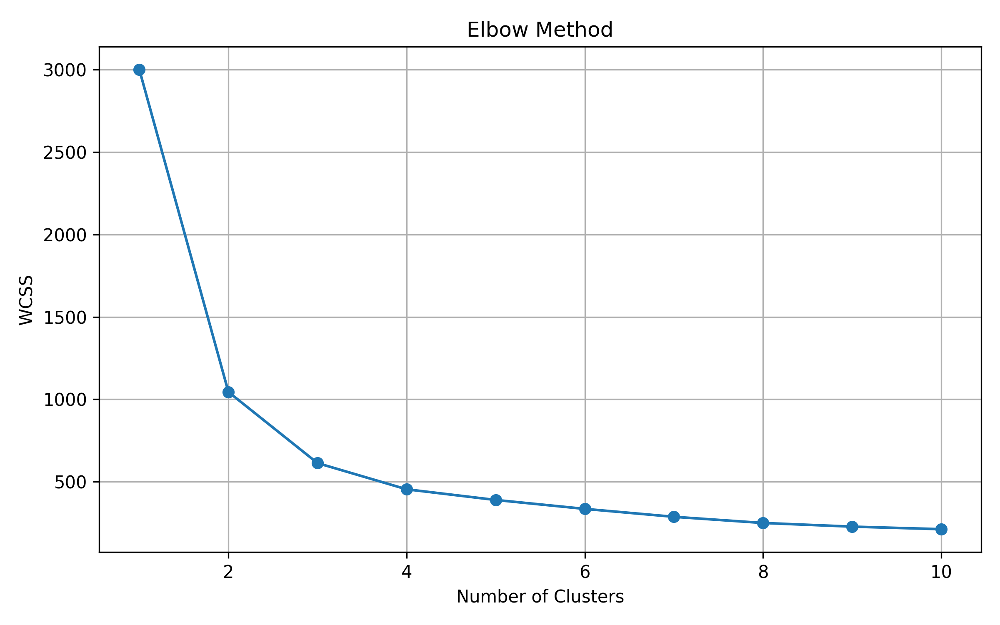
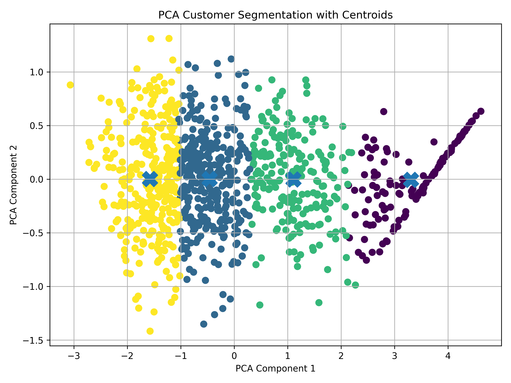
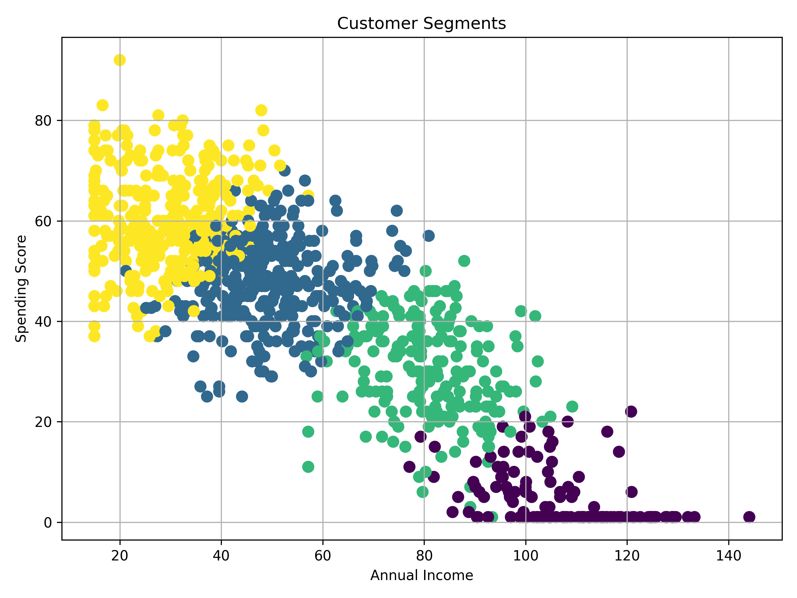
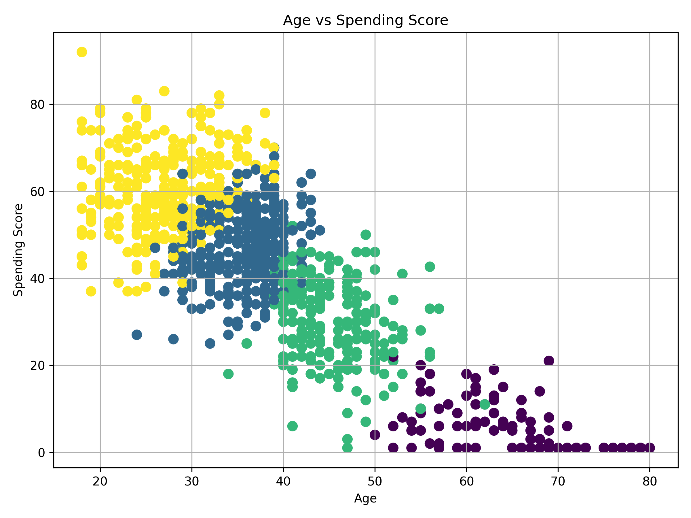
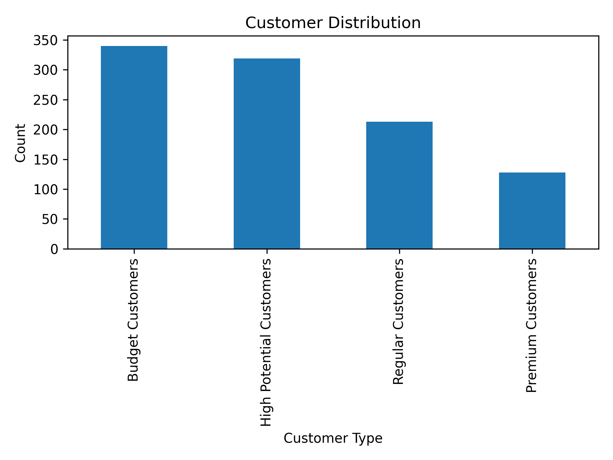

# 🛍️ Customer Segmentation using K-Means Clustering

## 📌 Project Overview
This project focuses on segmenting customers based on their purchasing behavior using Machine Learning (K-Means Clustering). The goal is to help businesses understand different types of customers and improve targeted marketing strategies.

---

## ❗ Problem Statement
Businesses struggle to understand customer behavior and identify different customer groups. This project solves this problem by using Machine Learning to group customers into meaningful segments.

---

## 🎯 Objective
To group customers into meaningful clusters based on:
- Age
- Annual Income
- Spending Score

---

## 📊 Dataset Information
The dataset contains customer details such as:
- Gender
- Age
- Annual Income (k$)
- Spending Score (1-100)

---

## 🔄 Workflow Summary
Data Collection → Data Cleaning → Feature Scaling → K-Means Clustering → Evaluation → PCA → Business Insights

---

## 🤖 Machine Learning Model
- Algorithm: K-Means Clustering  
- Evaluation Methods:
  - Elbow Method (WCSS)
  - Silhouette Score  

---

## 📊 Visualizations

### 🔹 Elbow Method


### 🔹 PCA Cluster Visualization


### 🔹 Income vs Spending Score


### 🔹 Age vs Spending Score


### 🔹 Customer Distribution


---

## 💡 Business Insights

### 🟢 Premium Customers
- High income, high spending  
- Ideal for loyalty programs  

### 🟡 Budget Customers
- Low spending behavior  
- Respond well to discounts  

### 🔵 Regular Customers
- Moderate income and spending  
- Stable customer base  

### 🟣 High Potential Customers
- High engagement potential  
- Can be converted into premium customers  

---

## 🧠 Skills Gained
- Data Cleaning & Preprocessing  
- Exploratory Data Analysis (EDA)  
- K-Means Clustering  
- Feature Scaling  
- Model Evaluation (Elbow Method, Silhouette Score)  
- PCA Visualization  
- Business Insight Generation  

---

## 🛠️ Technologies Used
- Python  
- Pandas, NumPy 
- Matplotlib  
- Scikit-learn  
- Joblib  

---

## 🚀 How to Run the Project

```bash
pip install -r requirements.txt
jupyter notebook
```

---

## 📁 Project Structure
```
customer-segmentation/
│
├── dataset/
├── outputs/
├── models/
├── customer_segmentation.ipynb
├── README.md
├── requirements.txt
```

---

## 📌 Results
- Successfully segmented customers into 4 clusters  
- Identified high-value customer groups  
- Generated actionable business insights  

---

## 📌 Project Impact
This project helps businesses improve targeted marketing, customer retention, and revenue optimization using data-driven customer segmentation.

---

## 👨‍💻 Author
Mounika Malineni

---
## 📌 Conclusion
This project demonstrates how unsupervised machine learning can be used to identify customer segments and generate actionable business insights for improving marketing strategies and customer engagement.
